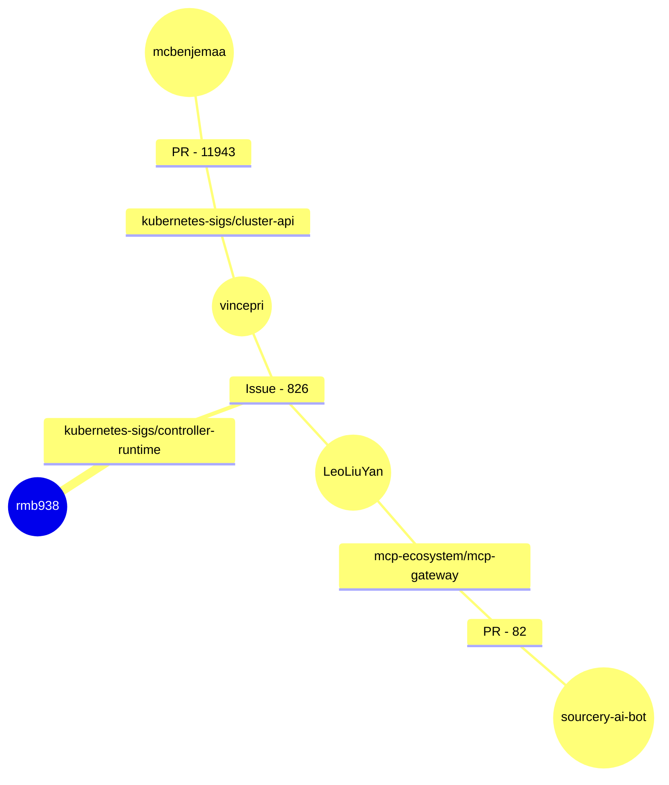

---
# You can also start simply with 'default'
theme: seriph
# random image from a curated Unsplash collection by Anthony
# like them? see https://unsplash.com/collections/94734566/slidev
background: /images/mario-verduzco-xSdFf1Lcx6o-unsplash.jpg
# some information about your slides (markdown enabled)
title: Six Degrees of Open Source
info: |
  How I’m mapping the OSS Collaboration Network
# apply unocss classes to the current slide
class: text-center
# https://sli.dev/features/drawing
drawings:
  persist: false
# slide transition: https://sli.dev/guide/animations.html#slide-transitions
transition: slide-left
# enable MDC Syntax: https://sli.dev/features/mdc
mdc: true
# open graph
# seoMeta:
#  ogImage: https://cover.sli.dev

fonts:
  sans: Plus Jakarta
  weights: 400,500,600
---

# Six Degrees of Open Source

<div class="mt-12 py-1">
  How I’m mapping the OSS Collaboration Network
</div>

<!--
The last comment block of each slide will be treated as slide notes. It will be visible and editable in Presenter Mode along with the slide. [Read more in the docs](https://sli.dev/guide/syntax.html#notes)
-->

---
layout: profile
image: /images/saKWC52.jpg
---

# Ryan Belgrave
Staff Engineer @ Confluent - WarpStream

~20 Years of technical experience, self-taught with Java in 2005

Ordered my first Ubuntu liveCD soon after and forever got stuck in vim

Running a homelab since 2012 when the first Raspberry Pi was released

Previously helped run the infrastructure automation for a few popular Minecraft servers

<br />

<carbon-logo-github /> [rmb938](https://github.com/rmb938)
<br />

<carbon-logo-linkedin /> [rbelgrave](https://www.linkedin.com/in/rbelgrave/)

---
layout: two-cols
---

# Six Degrees
Of Developers, not Kevin Bacon

Figure out how many hops away developers are from each other.

What repos do developers tend to work together on?

Are there any interesting themes that we can discover?

What other fun and interesting bits of information that we can find along the way?

::right::



---
---

# Where is the data coming from
Github Events

Github hosts an API that exposes all the public events happening on the platform.

Pull Requests, Issues, Commits, Watching, Wiki Updates, ect..

Github Archive exists to archive all the events exposed through that API
https://www.gharchive.org/

```ruby
require 'open-uri'
require 'zlib'
require 'yajl'

gz = open('http://data.gharchive.org/2015-01-01-12.json.gz')
js = Zlib::GzipReader.new(gz).read

Yajl::Parser.parse(js) do |event|
  print event
end
```

I want to use Stream Processing to easy distribute these events to other systems.

---
layout: two-cols
---

# Stream Processing the Events
Using Bento


Fancy stream processing made operationally mundane

https://warpstreamlabs.github.io/bento/

::right::

````md magic-move
```yaml
input:
  gcp_pubsub:
    project: foo
    subscription: bar

# Mapping Example
pipeline:
  processors:
    - mapping: |
        root.message = this
        root.meta.link_count = this.links.length()
        root.user.age = this.user.age.number()

output:
  redis_streams:
    url: tcp://TODO:6379
    stream: baz
    max_in_flight: 20
```
```yaml
...
# Multiplexing Outputs Example
output:
  switch:
    cases:
      - check: doc.tags.contains("AWS")
        output:
          aws_sqs:
            url: https://sqs.us-west-2.amazonaws.com/TODO/TODO
            max_in_flight: 20

      - output:
          redis_pubsub:
            url: tcp://TODO:6379
            channel: baz
            max_in_flight: 20
```
```yaml
...
# Windowing Example
buffer:
  system_window:
    timestamp_mapping: root = this.created_at
    size: 1h

pipeline:
  processors:
    - group_by_value:
        value: '${! json("traffic_light_id") }'
    - mapping: |
        root = if batch_index() == 0 {
          {
            "traffic_light_id": this.traffic_light_id,
            "created_at": @window_end_timestamp,
            "total_cars": json("registration_plate").from_all().unique().length(),
            "passengers": json("passengers").from_all().sum(),
          }
        } else { deleted() }

...
```
```yaml
...
# External Enrichments Example
pipeline:
  processors:
    - branch:
        request_map: |
          root.id = this.doc.id
          root.content = this.doc.body
        processors:
          - aws_lambda:
              function: sentiment_analysis
        result_map: root.results.sentiment = this

...
```
```yaml
# Easily Extenable with Custom Plugins
input:
  my_custom_input_plugin: {}

pipeline:
  processors:
    - my_super_secret_processor: {}

output:
  my_amazing_output_plugin: {}
...
```
````

---
layout: quote
---
# <logos-kafka-icon /> Kafka
If we are stream processing we need a stream!

Kafka is a distributed event streaming platform used for high-performance data pipelines, streaming analytics, data integration, and mission-critical applications.

https://kafka.apache.org/

---
transition: fade
---
# WarpStream
Zero-Disk Kafka with no inter-zone networking


---
---
# WarpStream
Zero-Disk Kafka with no inter-zone networking


---
---
# Distributed mmaps
Minimizing S3 API Costs


---
layout: two-cols
---
# Other BYOC Products

* Requires access to your VPC to deploy clusters.

* Requires expansive cross-IAM roles to manage the cluster remotely.

* Requires expensive and complex VPC peering.

 * Remote access is required for support, and elevated permissions can raise security issues. Break glass enables root access.

::right::

# WarpStream's BYOC

* Data / Metadata split enables WarpStream's control plane to function with no access to your VPC or object storage buckets.
* Only metadata is transferred between your VPC and WarpStream's control plane.
* It is impossible for WarpStream to access your data under any circumstances.

---
layout: center
---


[warpstream.com](https://www.warpstream.com/)

---
---
# Writing a Custom Bento Input Plugin

````md magic-move
```go {*|7|15}
package main

import (
	"context"

	// import all components with:
	_ "github.com/warpstreamlabs/bento/public/components/all"

	"github.com/warpstreamlabs/bento/public/service"
)

func main() {
	// RunCLI accepts a number of optional functions:
	// https://pkg.go.dev/github.com/warpstreamlabs/bento/public/service#CLIOptFunc
	service.RunCLI(context.Background())
}
```
```go
type githubArchiveInput struct {
}

func (i *githubArchiveInput) Connect(ctx context.Context) error {
	return nil
}

func (i *githubArchiveInput) ReadBatch(ctx context.Context) (service.MessageBatch, service.AckFunc, error) {
	batch := make(service.MessageBatch, 0)
	return batch, func(ctx context.Context, err error) error {}, nil
}

func (i *githubArchiveInput) Close(ctx context.Context) error {
	return nil
}
```
```go {*|2|6|8-17|10}
func inputSpec() *service.ConfigSpec {
	return service.NewConfigSpec().Fields(service.NewAutoRetryNacksToggleField())
}

func newInput(conf *service.ParsedConfig) (service.BatchInput, error) {
	return service.AutoRetryNacksBatchedToggled(conf, &githubArchiveInput{})
}

func init() {
	err := service.RegisterBatchInput("github_events_archive", inputSpec(),
		func(pConf *service.ParsedConfig, res *service.Resources) (service.BatchInput, error) {
			return newInput(pConf)
		})
	if err != nil {
		panic(err)
	}
}
```
```go {*|2|5-6|7-9|17-19|22}
batch := make(service.MessageBatch, 0)
archiveURL := fmt.Sprintf("https://data.gharchive.org/%s-%d.json.gz")
resp, _ := http.Get(archiveURL)

gzipReader, _ := gzip.NewReader(resp.Body)
jsonDecoder := json.NewDecoder(gzipReader)
for {
  var event github.Event
  if err := jsonDecoder.Decode(&event); err != nil {
    if err == io.EOF {
      break // End of stream
    }

    return nil, nil, fmt.Errorf("error decoding json object: %w", err)
  }

  jsonData, _ := json.Marshal(event)
  msg := service.NewMessage(jsonData)
  batch = append(batch, msg)
}

return batch, func(ctx context.Context, err error) error {}, nil
```
```go
for {
  i.trackedBatchesLock.Lock()
  if len(i.trackedBatches) == 0 {
    i.trackedBatchesLock.Unlock()
    break
  }
  i.trackedBatchesLock.Unlock()
  time.Sleep(5 * time.Second)
}

i.trackedBatchesLock.Lock()
defer i.trackedBatchesLock.Unlock()
...
archiveURL := fmt.Sprintf("https://data.gharchive.org/%s-%d.json.gz", 
    i.nextArchiveTime.Format("2006-01-02"), 
    i.nextArchiveTime.Hour())

...
i.nextArchiveTime = i.nextArchiveTime.Add(1 * time.Hour)
```
````

---
---
# I don't want to write a plugin
I don't know Golang, I'm not a programmer

```yaml
# https://warpstreamlabs.github.io/bento/docs/components/inputs/subprocess
input:
  subprocess:
    name: cat
    args: []
    codec: lines
    restart_on_exit: false

# https://warpstreamlabs.github.io/bento/docs/components/processors/subprocess
pipeline:
  processors:
    - subprocess:
        name: cat
        args: []

# https://warpstreamlabs.github.io/bento/docs/components/outputs/subprocess
output:
  subprocess:
    name: cat
    args: []
    codec: lines
```

---
layout: two-cols
---
# Running Bento
As simple as a `go run`

```bash {*|1|6|9-10}
$ go run main.go -c bento-config-gh.yaml 
INFO Running main config from specified file       @service=bento bento_version=v1.7.1 path=bento-config-gh.yaml
INFO Listening for HTTP requests at: http://0.0.0.0:4195  @service=bento
INFO Launching a Bento instance, use CTRL+C to close  @service=bento
INFO Output type kafka_franz is now active         @service=bento label="" path=root.output
INFO Input type github_events_archive is now active  @service=bento label="" path=root.input
No backpreasure starting
Got the lock
Downloading archive from https://data.gharchive.org/2025-05-14-20.json.gz
Sending batch with size 233916 Start ID: 49730103801 End ID: 49732035425
```

::right::

# Configuration
Simple, Boring, Configuration

````md magic-move
```yaml  {*|2|5-9}
input:
  github_events_archive: {}

output:
  kafka_franz:
    seed_brokers:
      - localhost:9092
    topic: github_events
    partitioner: uniform_bytes
```
```yaml
input:
  kafka_franz:
    seed_brokers:
      - localhost:9092
    topics:
      - github_events
    consumer_group: github_events
    auto_replay_nacks: true
    batching:
      count: 100
      period: 100ms
```
```yaml
pipeline:
  processors:
    # Ignore pushes and creates for now
    - mapping: |
        if this.type == "PushEvent" {
              root = deleted()
        }
        if this.type == "CreateEvent" {
              root = deleted()
        }
```
```yaml
output:
  opensearch:
    urls:
      - https://localhost:9200
    tls:
      enabled: true
      skip_cert_verify: true
    index: github_events
    action: index
    id: '${! json("id") }'
```
````

---
---
# Fun Metrics
WarpStream Throughput


---
---
# Fun Metrics
Bento and Elastic Output


---
---
# Word Clouds
☁️


---
---
# Top 10 Users
Yep it's all just bots


---
---
# What about without Bots
We Don't Serve Their Kind Here 🤖


---
layout: quote
---
# Still mostly bots

There must be real people using github right?

---
---
# Better but not perfect
Who knew 🤖 are so prevelent


---
---
# What are these top contributors doing?
Over 4k events per week...

<v-switch>
 <template #1></template>
  <template #2></template>
</v-switch>

---
---
# Top 10 Repos
The 🤖 have their own repos!?


---
---
# Top 10 Repos
Please no more 🤖


---
---
# Events over Time
Lots of work happening on the weekend


---
---
# Events by Repo
Lots of Watching


---
layout: quote
---

# We want a Graph!
How many hops am I away from a well known developer!

---
---
# Time for a Trial
Free 30 days for my Graph


---
---
# Disappointing
I don't know what I'm doing, maybe a Graph Database would have been better


---
---
# Some tweaking later
And reallllly looooong timeouts and 200k of buckets, it's beautiful!


---
---
# Zooming In to the center
It's a complicated mess


---
---
# Isolated Communities with some reaching back to the center
Is an open source monster!


---
---
# What's Next?
Data cleanup, maybe a better Graph Database

Filter out the bots in Bento so they don't scew the data as much

More event filtering to only save pull request and issue related events

Process a much larger dataset, multiple months instead of a single week

Possibly use Neo4J or other Graph Databases to explicitly set nodes and edges

Look at interesting moments in time like during the Log4Shell vulnerability to see if patterns or behaviors change  

---
layout: end
---

# Thanks You!
Q & A